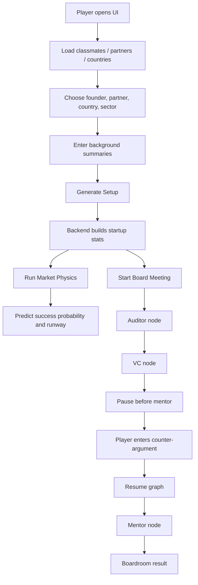
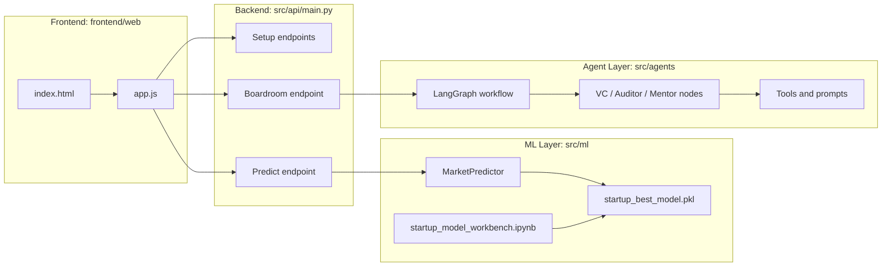

# Esade Entrepreneurs

Esade Entrepreneurs is a startup strategy simulation where you pick a founder profile, generate a startup setup, and then navigate quarterly boardroom decisions with support from an ML predictor and an LLM-driven advisory graph.

## What You Need

- Python 3.10+ recommended
- A virtual environment
- A `GROQ_API_KEY` in `.env` for the boardroom LLM flow

## Install

```bash
python -m venv .venv
.venv\Scripts\activate
pip install -r requirements.txt
```

## Configure Environment

Copy [.env.example](.env.example) to `.env` and set your key:

```env
GROQ_API_KEY=your_real_groq_api_key_here
```

## Run the App

Start the FastAPI backend from the project root:

```bash
uvicorn src.api.main:app --reload
```

Then open the UI in your browser:

- `http://127.0.0.1:8000/ui/index.html`

The backend also serves a JSON health response at `/`.

## Partner Selection Feature

When setting up your startup, you can now select two co-founders from interactive profile card systems:

- **Celebrity Co-Founder**: Choose from 8 industry leaders (Elon Musk, Taylor Swift, Steve Jobs, and more)
- **Academic Specialist**: Choose from 6 research experts (Jose A. Rodriguez-Serrano, Oriol Rius, and more)

Each partner has:
- Distinctive avatar image
- Core ability (special expertise)
- Domain (area of focus)
- 8 key stats (Growth, Brand, Product, Tech, Ops, Finance, Innovation, Execution)
- Strengths highlighting key specializations

Certain partner combinations unlock synergies that boost your startup's capabilities. See [PARTNER_SELECTION_GUIDE.md](PARTNER_SELECTION_GUIDE.md) for the full list of available partners and synergy combinations.

## Optional: Retrain the ML Model

Training now lives in a notebook instead of a standalone training script.

Open and run [src/ml/startup_model_workbench.ipynb](src/ml/startup_model_workbench.ipynb) to:

- Train three candidate models
- Compare accuracy, precision, recall, F1, and ROC AUC
- Plot ROC curves for all candidates
- Select the best model automatically
- Save the final pipeline to `src/ml/models/startup_best_model.pkl`

The FastAPI app loads that saved pipeline through [src/ml/predictor.py](src/ml/predictor.py).

## How To Play

### 1. Choose Your Startup Setup

In the left sidebar, select:

- A classmate founder
- A partner type: Technical Co-founder, Business Co-founder, or Solo Founder
- A country
- A sector
- Founder and co-founder background summaries if you want to override or supplement the auto-filled data

Click **Generate Setup** to initialize the startup. The backend combines the selected classmate record, background text, partner modifiers, and country profile to generate the startup's initial budget, burn rate, revenue, and founder experience.

### 2. Inspect the Starting Metrics

After setup, the UI unlocks the main actions and shows:

- Budget
- Burn rate
- Revenue
- Founder experience
- Runway and success probability after prediction
- Attention Points and team capacity

### 3. Run Market Physics

Click **Run Market Physics** to ask the ML model for an early success estimate. This is a lightweight read-only prediction step that uses the startup metrics and returns:

- Success probability
- Runway estimate

### 4. Start the Board Meeting

Click **Start Board Meeting** to enter the decision loop.

The game sends your current startup state to the backend, which runs a LangGraph workflow with:

- An auditor node that checks survival probability
- A skeptical VC node that pushes back on the pitch
- A mentor node that responds with practical startup advice

The graph pauses before the mentor step so you can enter a counter-argument and resume the discussion.

### 5. Submit a Counter-Argument

When the boardroom flow pauses, type your response in the pitch box and click **Submit Counter-Argument**. The graph resumes and continues the conversation.

### 6. Keep Iterating

You win by managing the tradeoff between growth and survival:

- Complete milestones
- Keep runway alive
- Raise funding when needed
- Hire carefully
- React to boardroom feedback

## Game Instructions

### Core Objective

Build a viable startup before cash runs out. The game is designed to feel like a founder simulation rather than a pure numbers puzzle.

### Main Resources

- **Cash**: Your available capital
- **Burn Rate**: What you spend each quarter
- **Revenue**: What you earn each quarter
- **Runway**: How long you can survive before cash depletion
- **Attention Points**: The action budget you spend on decisions
- **Milestones**: Major goals needed to win

### Decision Loop

Each quarter, you should:

- Review current cash and runway
- Decide whether to fundraise, hire, or push milestones
- Read the VC and mentor feedback carefully
- Use the counter-argument step to defend your choices

### Practical Tips

- High burn with low revenue shortens runway quickly
- Hiring increases capability, but also raises burn
- Founder and sector fit affect the startup setup
- The help modal in the UI summarizes the same rules in-game

### Founder Intro Card

When you select a founder, the UI displays a short biographical summary. The app attempts to fetch the founder's public LinkedIn profile, parse the page text, and use an LLM to generate a concise 2-sentence intro. If the page is blocked or too sparse, the app falls back to the local roster metadata (experience, background, notes, sector tags).

This flow replaces an older, depreciated external API and allows graceful degradation when LinkedIn blocks direct fetching.

## Underlying Architecture

The app has three layers:

- **Frontend**: static HTML and vanilla JavaScript in `frontend/web`
- **API**: FastAPI backend in `src/api/main.py`
- **Simulation / AI**: ML predictor in `src/ml` and LangGraph boardroom logic in `src/agents`

### Runtime Flow



### System Architecture



## Key Files

- [frontend/web/index.html](frontend/web/index.html)
- [frontend/web/app.js](frontend/web/app.js)
- [src/api/main.py](src/api/main.py)
- [src/agents/graph.py](src/agents/graph.py)
- [src/ml/predictor.py](src/ml/predictor.py)
- [src/ml/startup_model_workbench.ipynb](src/ml/startup_model_workbench.ipynb)
- [.env.example](.env.example)

## API Endpoints

- `GET /` returns backend status and the UI path
- `GET /api/setup/countries` returns the country list
- `GET /api/setup/classmates` returns founder candidates
- `GET /api/setup/partners` returns partner options
- `POST /api/setup/founder` generates the startup setup
- `POST /api/predict` returns success probability and runway
- `POST /api/boardroom_turn` runs the boardroom conversation graph

## Data Sources

The simulation uses bundled local data and models:

- `data/classmates.csv`
- `data/startup_funding_and_outcome.csv`
- `cost_of_living.csv`
- `src/ml/models/startup_best_model.pkl`
- `src/data/chroma_db/` for vector-store-backed advisory content

## Notes

- The boardroom graph requires `GROQ_API_KEY` to call the LLM.
- If the model file is missing, the predictor falls back to a simple default probability.
- The frontend is served by the FastAPI app under `/ui/index.html`.
- The game is designed around short setup cycles and repeated boardroom iterations.

## Roadmap: Next Steps

### 1. Fix LinkedIn Data Retrieval

Currently, founder intros fall back to roster data when LinkedIn blocks scraping. Options to improve:

- Integrate a paid or dedicated LinkedIn scraping service
- Use a browser-based scraper (e.g., Playwright) to bypass anti-bot walls
- Cache profile summaries locally in `data/classmates.csv` after first successful fetch
- Consider using other professional networks (Crunchbase, AngelList) as primary or fallback sources

### 2. Replace Technical Partner with ESADE Faculty & Entrepreneurs

Expand the partner selection from generic archetypes to actual ESADE professors and famous entrepreneurs/celebrities:

- Update [src/data/founder_roster.py](src/data/founder_roster.py) partner options
- Add mentor-specific attributes (e.g., expertise area, success track record)
- Adjust synergy bonuses and burn/budget multipliers based on mentor profile
- Display mentor bios and credentials in the UI

### 3. Redesign UI for Boardroom Immersion

Transform the current game log into an interactive boardroom setting:

- Asset-based or avatar-based representation of the VC, Auditor, and Mentor
- Real-time dialogue flow instead of a scrolling log
- Character interjections (e.g., animated reactions, position changes)
- Audio or text-to-speech for mentor and VC feedback
- Visual feedback for decision impact (runway, budget changes)
- Consider a full-screen boardroom mode or split-pane layout for immersion

