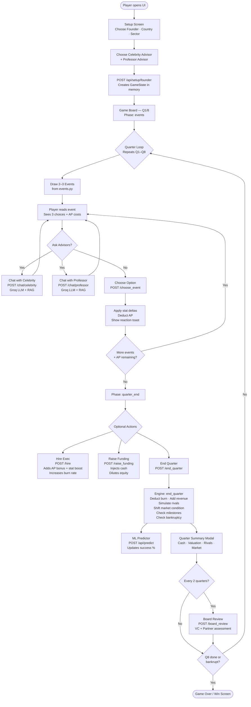
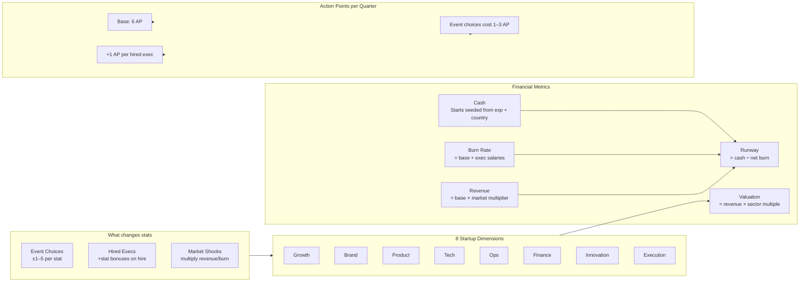
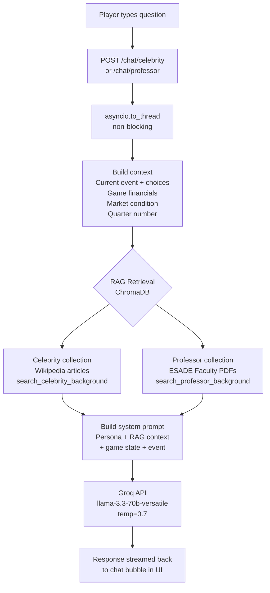
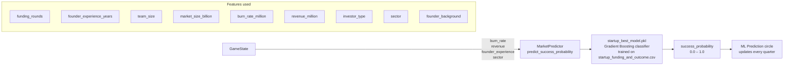
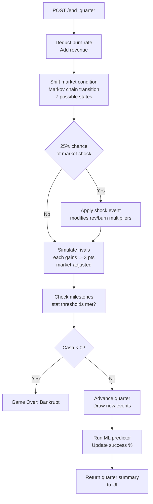

# ESADE Entrepreneurs — 8-Quarter Startup Simulation

A startup decision game built for ESADE MBA cohorts. Play as a founder through 8 quarters of events, advisor chats, hiring, fundraising, and board reviews — all powered by LLM agents and an ML success predictor.

---

## What It Is

- **8 quarters** (2 years) of startup decisions
- **Pre-written events** per quarter across Product, Growth, Brand, Tech, Ops, Finance departments
- **LLM advisory chat** — ask your Celebrity and Professor advisors anything before choosing
- **Market dynamics** — 7 market conditions (Boom, Recession, AI Hype, etc.) that shift each quarter
- **Rival simulation** — 3 sector competitors that gain momentum each quarter
- **Hiring system** — 4 exec slots (CTO, CMO, CFO, COO), each with 3 candidates
- **Fundraising** — 5 stages from Bootstrap → Angels → Seed → Series A → Series B
- **Milestones** — 3 sector-specific goals to achieve before Q8
- **ML prediction** — live success probability based on burn, revenue, experience, and sector
- **Board reviews** — VC/partner review at Q2, Q4, Q6, Q8

---

## Game Architecture & Flow

### 1. Full Game Lifecycle



---

### 2. Score & Stats System



---

### 3. Advisory Chat — Backend Integration



---

### 4. ML Prediction — Backend Integration



---

### 5. Market & Rivals — Quarter End Engine



---

- Python 3.10+ (use the `.venv` in the project root — it has all dependencies)
- `GROQ_API_KEY` in a `.env` file

---

## Environment Setup

Copy `.env.example` to `.env` and set:

```env
GROQ_API_KEY=your_real_groq_api_key_here
```

---

## Running the Server

**Always use the project `.venv`** — the system Python does not have the required packages.

From the project root (Git Bash / WSL):

```bash
.venv/Scripts/uvicorn.exe src.api.main:app --host 127.0.0.1 --port 8002
```

Or on Windows CMD / PowerShell:

```cmd
.venv\Scripts\uvicorn.exe src.api.main:app --host 127.0.0.1 --port 8002
```

Then open:

```
http://127.0.0.1:8002/ui/index.html
```

> **Port 8000 is often occupied by ghost processes on Windows.** Use `--port 8002` (or any free port). If you change the port, just open the same port in the browser — `app.js` uses `window.location.origin` so it automatically uses whichever port serves the UI.

---

## How to Play

1. **Choose Your Founder** — select a classmate from the roster
2. **Pick a Country** — affects cost of living, burn rate, and initial budget
3. **Choose Partners** — pick 1 Celebrity advisor + 1 Professor advisor (synergy bonuses apply)
4. **Click "Launch Your Startup"** — game starts at Q1 in Events phase
5. **Resolve Events** — each quarter draws 2–3 decision events; spend AP to choose options
6. **Ask Advisors** — before choosing, chat with your Celebrity or Professor for LLM-powered advice
7. **Hire Execs** — open Hire Exec to fill CTO / CMO / CFO / COO slots (adds AP bonus + stat boosts)
8. **Raise Funding** — accept investor offers to top up cash at the cost of equity
9. **End Quarter** — review the quarter summary: market news, financials, rival activity
10. **Board Review** — every 2 quarters, the VC board reviews your progress
11. **Win** — complete all 3 milestones before Q8, or survive to the end

---

## Game Mechanics

### Action Points (AP)
- Start with 6 AP per quarter (+1 per hired exec)
- Each event choice costs 1–3 AP
- Unused AP is lost at end of quarter

### Stats (8 dimensions)
Growth · Brand · Product · Tech · Ops · Finance · Innovation · Execution

### Market Conditions
7 conditions with revenue/burn multipliers, updated each quarter via Markov chain:
`AI Hype` · `AI Winter` · `Regulation Wave` · `Talent War` · `Boom` · `Recession` · `Stable`

### Funding Stages
Bootstrap → Angels → Seed → Series A → Series B

---

## API Endpoints

### Setup
| Method | Endpoint | Description |
|--------|----------|-------------|
| `GET` | `/api/setup/countries` | List all countries with cost-of-living data |
| `GET` | `/api/setup/classmates` | List classmate founders |
| `GET` | `/api/setup/classmate-intro?name=...` | Short bio from roster |
| `GET` | `/api/setup/celebrity-partners` | List celebrity advisors |
| `GET` | `/api/setup/professor-partners` | List professor advisors |
| `POST` | `/api/setup/founder` | Create a new game session → returns `game_id` |

### Game Loop
| Method | Endpoint | Description |
|--------|----------|-------------|
| `GET` | `/api/game/{id}/state` | Full current game state |
| `POST` | `/api/game/{id}/choose_event` | Pick an event choice `{event_id, choice_index}` |
| `POST` | `/api/game/{id}/skip_events` | Skip remaining events this quarter |
| `POST` | `/api/game/{id}/chat/celebrity` | Chat with celebrity advisor |
| `POST` | `/api/game/{id}/chat/professor` | Chat with professor advisor |
| `POST` | `/api/game/{id}/end_quarter` | Finalize quarter, advance to next |
| `GET` | `/api/game/{id}/candidates` | List hireable candidates |
| `POST` | `/api/game/{id}/hire` | Hire a candidate `{candidate_id}` |
| `POST` | `/api/game/{id}/fire` | Fire a staff member `{staff_id}` |
| `GET` | `/api/game/{id}/funding` | Get current investor offer |
| `POST` | `/api/game/{id}/raise_funding` | Accept funding offer |
| `POST` | `/api/game/{id}/board_review` | Trigger VC board review |
| `GET` | `/api/game/{id}/quarter_summary` | Get last quarter summary |

---

## Key Files

### Frontend
| File | Purpose |
|------|---------|
| `frontend/web/index.html` | 3-column game board UI |
| `frontend/web/app.js` | Game engine — state management, all API calls, render loop |
| `frontend/web/styles.css` | Light theme — event cards, chat bubbles, stat bars, modals |

### Backend
| File | Purpose |
|------|---------|
| `src/api/main.py` | FastAPI app — all endpoints, game session store |
| `src/game/state.py` | `GameState` Pydantic model + `ChatMessage` |
| `src/game/engine.py` | Core game logic — events, quarter lifecycle, hiring, funding |
| `src/game/advisor.py` | LLM advisory chat — celebrity + professor Groq calls with RAG |
| `src/agents/graph.py` | LangGraph board review graph (VC + partner) |
| `src/agents/prompts.py` | System prompts for all LLM agents |
| `src/data/events.py` | ~150 pre-written decision events |
| `src/data/market.py` | 7 market conditions + Markov transitions + headlines |
| `src/data/rivals.py` | Rival companies + quarterly simulation |
| `src/data/hiring.py` | 12 exec candidates (3 per role) |
| `src/data/milestones.py` | 3 milestones per sector (15 total) |
| `src/data/founder_roster.py` | Classmate roster + partner definitions + synergy system |
| `src/data/vector_db.py` | ChromaDB — celebrity Wikipedia RAG + professor PDF RAG |
| `src/data/cost_of_living_data.py` | Country cost-of-living profiles |
| `src/ml/predictor.py` | ML success probability model |

### Data
| Path | Contents |
|------|----------|
| `data/classmates.csv` | Classmate roster with LinkedIn URLs |
| `data/ESADE Faculty/` | Professor PDFs (for RAG) |
| `src/data/chroma_db/` | Persisted ChromaDB vector collections |

---

## Notes

- **GROQ_API_KEY** is required for advisor chat and profile intro generation
- **ML model**: if `src/ml/models/startup_best_model.pkl` is missing, predictor falls back to a baseline estimate
- **Game sessions** are stored in-memory — restarting the server clears all active games
- **Always open a fresh browser tab** when starting a new session or after restarting the server. Reusing an old tab can leave stale HTTP connections that cause the game launch to hang silently
- **Advisory chat** is non-blocking (`asyncio.to_thread`) so the UI never freezes during LLM calls
- **LinkedIn profiles** are not fetched (LinkedIn blocks bots) — classmate intros come from the roster CSV
- On Windows, always use the `.venv` interpreter: `python -m pip` and `.venv/Scripts/uvicorn.exe`
